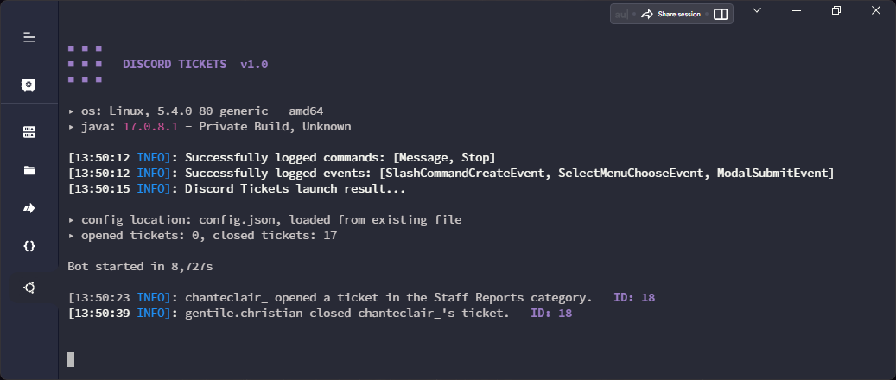

<h2 align="center"> <samp>DISCORD TICKETS</samp> </h1>
<p align="center"> 
  
  
</p>

<br />

<h2 align="center"> <samp>SHOWCASE</samp> </h1>
<p align="center">
  
</p>

<br />

<h2 align="center"> <samp>CONFIGURATION</samp> </h1>
<p align="center">
  <samp> After the first launch you will notice that a file called `config.json` will be created. <br /> This is the bot's configuration file. Remember to fill all the changes otherwise the bot will not start. </samp>
</p>

```json
{
  "discord": {
    "token": "MTE1ODcyODg3Mjg3MTg2NjM4OQ.GQWOCL.Mxdny-ZJ-HPIFkeHZwbshGiPc8E0d64DJ7kxKI"
  },

  "mongo": {
    "hostname": "127.0.0.1",
    "username": "admin",
    "password": "password"
  }
}
```

<br />

<h2 align="center"> <samp>CONFIGURATION</samp> </h1>
<p align="center">
  <samp>This project is licensed under the </samp> <a href="LICENSE"><samp>General Public License 3.0</samp></a>
</p>

<br />